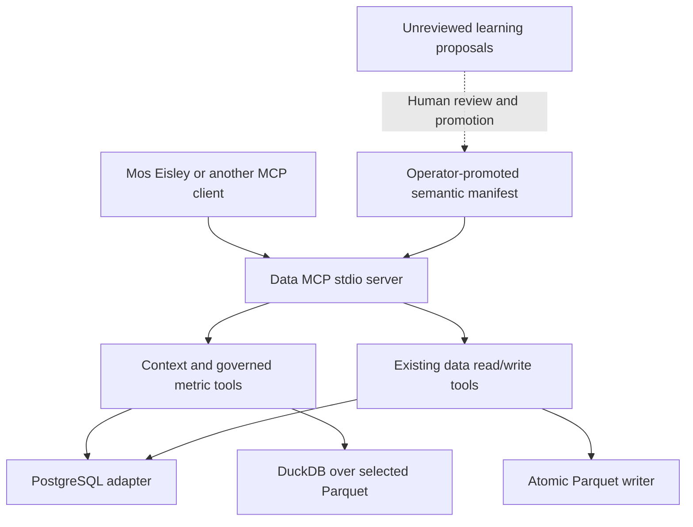

# Ana Lite integrated with Data MCP

Revised 2026-09-06 from `/Users/josh/Downloads/ana-lite-plan.md`.
[Adversarial findings](reviews/ana-lite-adversarial-review.md) provide evidence and
acceptance criteria; [verification](reviews/ana-lite-verification.md) records actual
checks. This document distinguishes implemented infrastructure from future agent/UI
work. The original Downloads plan is retained unchanged.

## Outcome and architecture

Test whether a small, operator-maintained semantic layer improves answers and reduces
avoidable schema exploration enough to justify its maintenance. Preserve data-mcp's
existing ability to read/write both Parquet and PostgreSQL.



The client owns model selection, orchestration, spend admission, answer attribution,
provider data-transfer policy and UI. Data MCP owns source configuration, source
access, semantic definitions and metric execution. It makes no model calls. Do not
introduce another SQLAlchemy Warehouse with its own permissions, limits and credentials.
Mos Eisley's `feat/data-mcp-client` integration supplies stdio discovery, calls and
a canonical agent dispatcher; see [connection and verification](MOS_EISLEY.md).
Its bounded OpenAI analytical workflow is implemented on a separate feature branch;
live conformance remains open, while the bounded answer/artifact slice is
implemented on a further branch (Stages 3–4). An offline analytical evaluator now
checks reviewed expectations against saved bundles (bounded parts of Stages 0/6).

## Implemented integration slice

The existing read/write server remains the default (`access_mode="read_write"`).
An optional `access_mode="analysis"` omits mutation tools, denies direct adapter writes,
and reports effective write permissions as false even if a source is marked writable.
For a real analysis deployment also use a dedicated PostgreSQL read-only role and
read-only filesystem mounts. Tool annotations alone grant no authority.

Set `ontology_file` to one absolute, operator-promoted TOML manifest. The file is read
once into memory at startup, capped at 64 KiB, parsed with a closed schema and given
a SHA-256 revision. Context serialization must fit the configured byte budget. Bad
manifests fail startup/`--check`; there is no partial load or silently dropped note.
Unknown sources, SQL writes, unsupported Parquet functions and invalid timezones fail
validation. Selecting an ontology grants no additional source access.

Three optional tools are registered when a manifest is configured:

| Tool | Inputs | Behavior |
|---|---|---|
| `get_semantic_context` | none | Promoted notes, complete fixed metric definitions and revision |
| `list_metrics` | none | Names, descriptions, source bindings, grain, units, output columns, revision |
| `run_metric` | name, revision | Execute the stored SELECT through one existing adapter; reject stale revision, wrong output columns or truncation |

The metric source and SQL are not caller arguments. Each metric specifies backend,
source alias, relative Parquet paths where applicable, description, grain, units,
IANA timezone, owner, review date, expected output columns and literal SQL. The adapter
sets the session timezone for metric execution. Responses include metric/revision,
source, submitted/normalized SQL, execution timestamps and `data_snapshot=null`.
The last field deliberately makes the missing data-snapshot contract visible.

This is a small semantic catalog, not a typed ontology compiler or a complete Ana
agent. Parameters, output-type/nullability contracts, freshness enforcement, source
snapshot identities, automatic learning, provider evaluation and a public UI are
still pending. Metadata documents intent; it does not prove the definition is correct.
The current adapters normalize SQL through SQLGlot; `normalized_sql` records that
form, and Parquet reads additionally use the adapter's bounded outer SELECT.

Use TOML for this first integration because it shares Python's built-in bounded-file
parser with project configuration and avoids a second config stack. The original
YAML schema can be migrated once, keeping SQL/notes as literal strings. This is a
format choice, not a custom DSL. A single explicit manifest eliminates accidental
recursive ingestion of golden answers, drafts or agent-generated proposals.

Example launch:

```sh
uv run --frozen data-mcp --config config.ana.example.toml --check
uv run --frozen data-mcp --config config.ana.example.toml
```

The checked-in example uses `/Volumes/raw/parquet` and `ANA_LOCAL_READ_DSN`. It contains
a synthetic archive row count and connection diagnostic, **not real business metrics**.
Copy it to a private local config, set the source paths and credential reference, and
write your reviewed definitions before evaluating useful answers. Manifest changes
become active on server restart; consumers fetch the new revision. The current process
continues using its old snapshot until restarted.

## Stage 0 — Freeze the question and evaluation contract

Choose one known schema/source without looking for a failing baseline after the fact.
Use the five original questions as development smoke cases. Define a separate unseen
holdout by question family, including clarification, join fan-out, required filters,
nulls, units/sign, time bounds and unavailable/truncated sources. Expected results
belong in an evaluation directory never served as runtime context.

For each case record input fixture/snapshot, question, expected behavior (answer,
clarification or unavailable), reviewed SQL, expected output schema, units, comparison
tolerance and ordering rules. Record maintenance time and proposed usefulness criteria
before experimentation. Freeze model/provider/version, prompt, tools, budgets and
context treatment for each arm; run all arms through the same runner. Five questions
can show plumbing, not reliable generalization. Larger evaluation needs task-specific
sample sizing; do not prescribe an arbitrary sample as proof.

**Offline tooling status, 2026-09-09:** Mos Eisley `feat/analysis-evaluation` defines
bounded suites with per-arm expectations, asserted fixture identities, reviewed SQL,
source/unit bindings and typed cell/tolerance/order rules. Task export omits golden
labels and enforces disjoint declared question families. Suite hashes and new
configuration/prompt/tool-catalog identities bind scoring inputs, but do not prove
independent review, source snapshots, preregistration or semantic holdout secrecy.
The packaged example is synthetic; actual domain cases still require review.

Done when: cases and labels are independently reviewable, development and holdout
families are distinct, and data cannot drift between treatment arms.

## Stage 1 — Configure and verify source access

Use the existing server configuration and analysis profile. Validate mounts, cloud TLS
and named source credentials. Database grants must be created by the responsible
operator for actual object owners, with existing/future table and function tests.
Do not copy a default-privilege command without identifying who creates new tables.
Read-only transactions backstop permissions; roles still govern function privileges.

Use `list_sources`, schema tools and direct fixture reads. Test forbidden writes at
the database role boundary separately from parser/tool rejection. Exercise missing
mounts, lock/statement timeouts, oversized cells and cancellation behavior. Raw data
management continues through the distinct read/write profile when required.

Done when: approved sources are accessible and permissions are demonstrated against
fixtures with the actual intended role; no live unrestricted source is inferred from
a successful `--check` (it does not connect).

## Stage 2 — Seed and execute a few governed definitions

Hand-write conventions and two or three reviewed metrics in the promoted manifest.
Make source/grain/units/timezone and null/dedup/join assumptions explicit. Call
`get_semantic_context`, then `run_metric` with the returned revision. Check output
against fixtures before involving a model. Reuse this tool for notebook/panel/agent
consumers; free-form queries are ad hoc and cannot claim canonical status.

Before user-driven date ranges or filters, add a typed parameter schema with prepared
bindings in both adapters, explicit allowed ranges and timezone/bound conventions.
Do not concatenate model text into SQL. Before evaluating changing live data, add
immutable source/snapshot identifiers and a result envelope with output types,
completeness, provenance and result IDs. Add fixture cases for schema drift and
nonfinite/decimal serialization.

Done when: governed definitions are useful without a model and failures are explicit.
Do not call matching column names a complete schema-drift check.

## Stage 3 — Integrate the bounded client loop

**Remote MCP connection status, 2026-09-09:** Mos Eisley M11A implements
Streamable HTTP with securely referenced tokens, bounded network responses,
explicit tool/write grants and uncertain-write handling on `feat/remote-mcp-http`.
See the [HTTP verification](https://github.com/joshuamyers22/mos-eisley/blob/feat/remote-mcp-http/docs/MCP_HTTP_VERIFICATION.md).
M11B is implemented for pre-registered public clients on `feat/mcp-oauth`, with
OAuth discovery/login, OS keychain storage, user/server credential binding, explicit
scopes, serialized refresh, reauthentication and logout/revocation reporting.
Other registration methods remain unsupported; native vault/provider deployment
still needs operator verification. See the
[OAuth evidence](https://github.com/joshuamyers22/mos-eisley/blob/feat/mcp-oauth/docs/MCP_OAUTH_VERIFICATION.md). The
[Mos Eisley plan §13.3](https://github.com/joshuamyers22/mos-eisley/blob/feat/mcp-oauth/docs/mos-eisley-plan.md#133-remote-mcp-connections--planned-m11a-and-m11b)
defines both stages and their acceptance tests. These connect existing hosted
servers; data-mcp's local stdio deployment remains usable without either stage.
The `feat/mcp-schema-compatibility` client branch now adds bounded local schema
references, locally enforced constraints and explicit JSON argument wrappers for
nullable fields, unions and dictionaries. See the
[schema evidence](https://github.com/joshuamyers22/mos-eisley/blob/feat/mcp-schema-compatibility/docs/MCP_SCHEMA_VERIFICATION.md).
Unsupported vocabularies remain blocked. Connection/schema work alone does not
enable paid tool calls. The separate analytical milestone below now supplies an
explicit opt-in provider path.

Use the Mos Eisley MCP client adapter with its analysis configuration. The
connection and bounded OpenAI analytical conversation are implemented on
`feat/bounded-mcp-analysis`. First fetch promoted context; prefer
`run_metric`; use source schema/query tools only for an ad-hoc question.
Ask when the metric/source/time range
is ambiguous. Keep tools and semantic text distinct from trusted controller policy.

Before any paid call, enforce per-user/account cost reservations, maximum turns,
provider output tokens, tool calls, queue size and whole-run deadlines. Cancellation
must propagate to supported operations, and the client must understand that current
file writes are not aborted by cancellation. Never automatically retry uncertain
writes. A local semaphore is not a distributed concurrency or spend limit.

The current server's query timeouts and two running operations do not supply this
whole-agent budget. Mos Eisley's existing one-prompt OpenAI spending machinery is
not automatically an Anthropic multi-turn budget. Choose model IDs and pricing from
verified provider/account configuration at the time of execution.

**Bounded analytical status, 2026-09-09:** Mos Eisley now supplies `analysis-demo`
and an opt-in `analysis-run` OpenAI path. It enforces promoted-context/metric
revision binding, explicit read-only grants, aggregate token/byte/turn/tool limits,
serial tool dispatch, bounded pending calls and whole-run cancellation. A private
operator-selected ledger atomically reserves worst-case run cost and admission
slots before provider credentials or data transfer. Unknown billing and crashes
retain the full reservation. This covers cooperating processes using one ledger;
account labels are operator assertions, not authenticated distributed quotas.
The CLI uses memory-only content retention and emits an answer/evidence summary
plus a monetary receipt. It does not create transcript/SQL artifacts or independently
verify numerical claims. Anthropic/Google remain future provider integrations.
See [configuration](https://github.com/joshuamyers22/mos-eisley/blob/feat/bounded-mcp-analysis/docs/ANALYSIS.md)
and [verification](https://github.com/joshuamyers22/mos-eisley/blob/feat/bounded-mcp-analysis/docs/ANALYSIS_VERIFICATION.md).

Done when: fixture conversations answer, clarify, refuse unavailable input and stop
at budget limits; adversarial source text cannot obtain a tool outside the profile.
Live-provider evaluation remains separately budgeted and authorized.

## Stage 4 — Make answer claims and artifacts reviewable

**Implemented bounded slice, 2026-09-09:** Mos Eisley
`feat/analysis-evidence-artifacts` returns schema-2 envelopes with original tool
calls/responses, SQL trail, controller and source-reported timestamps, promoted
revision, completeness and usage. Answer proposals name specific result cells and
expected scalar values; the controller checks them and renders the answer text.
Wrong values, type confusion, duplicate columns, missing cells and incomplete
results fail. Returned-cell matching does not prove the source is correct or the
metric/time period is appropriate; source snapshots remain explicitly unverified.

Optional private retention requires configuration plus explicit CLI consent and a
private destination. UUID bundles support local integrity/lineage verification,
access expiry and explicit cleanup. Bounded CSV exports use a named captured result,
retain parent/result hashes and never rerun SQL. Physical cleanup is explicit;
expiry alone is not deletion. The default remains memory-only content retention.
See the [operator contract](https://github.com/joshuamyers22/mos-eisley/blob/feat/analysis-evidence-artifacts/docs/ANALYSIS_EVIDENCE.md)
and [verification](https://github.com/joshuamyers22/mos-eisley/blob/feat/analysis-evidence-artifacts/docs/ANALYSIS_EVIDENCE_VERIFICATION.md).
Arbitrary narrative/arithmetic verification, measured domain quality and chart/UI
work remain open beyond this bounded cell-answer/export slice. Offline comparison
with reviewed domain expectations is now available as described in Stage 6.

Create an answer envelope with status, final text, supporting result IDs, SQL trail,
metric revision, source snapshot, timestamps, completeness and provider usage. The
last tool result is not automatically the chart/table source. Persist private UUID
run artifacts only under the owner's retention policy; diagnostic MCP telemetry
continues to omit SQL, rows, paths and credentials.

A complete CSV download requires a separate bounded artifact/export operation; it
cannot be built from already-truncated MCP rows. Store result/chart lineage and
avoid rerunning a changing query while claiming the download is the same result.

Done when: an intentionally wrong/truncated/ambiguous fixture cannot become an
unqualified numeric answer, and every visible number can be traced to evidence.

## Stage 5 — Introduce proposals only if useful

A future `propose_learning` may create bounded, immutable proposals in controller-owned
storage. It must not edit the active manifest, notes or metric SQL. Do not expose
filesystem Markdown writes through the Parquet API or overload the data writer for
ontology promotion. Proposal IDs carry evidence/source/scope and uncertainty, not
raw private data copied into Git.

Review promotes, edits or rejects proposals; approved changes update the manifest,
run regressions, and restart the server. Roll back by restoring an earlier reviewed
manifest. Neither volume nor a lower junk percentage alone proves learning quality.
Keep the manual layer if proposals do not earn their review burden.

Done when: proposal creation never changes runtime revision, and accepted changes
have traceable reviewers, scope and regression evidence.

## Stage 6 — Compare under controlled conditions

**Implemented bounded slice, 2026-09-09:** Mos Eisley `feat/analysis-evaluation`
grades private captured bundles offline against a frozen reviewed suite. It checks
question, provider/model, configuration/prompt/tool-catalog hashes, promoted revision,
expected status and typed cells bound to reviewed SQL/arguments/source metadata.
Every planned case/arm stays in the denominator, including omitted, failed, expired
and invalid runs; duplicate assignments and reused artifacts reject the submission.
Reports include descriptive counts, reported usage, retained spending and latency
with explicit unknown counts. Grading makes no provider calls or source queries.
See the [operator guide](https://github.com/joshuamyers22/mos-eisley/blob/feat/analysis-evaluation/docs/ANALYSIS_EVALUATION.md)
and [verification](https://github.com/joshuamyers22/mos-eisley/blob/feat/analysis-evaluation/docs/ANALYSIS_EVALUATION_VERIFICATION.md).

This does not establish source truth, source snapshot identity, statistical benefit,
explanation quality or a controlled comparison. Randomized/interleaved live execution,
probe/maintenance accounting and assessment of reviewed domain cases remain open.
Automatic learning/promotion remains deferred pending useful evidence.

**Raw baseline status, 2026-09-09:** Mos Eisley `feat/analysis-raw-baseline` adds
explicit `context_mode="raw"`: source discovery and configured raw read tools through
the same controller, budgets, spending and artifact checks. It excludes promoted
semantic tools, records no semantic revision and supports raw/promoted arms in the
offline grader. Use [config.ana-raw.example.toml](../config.ana-raw.example.toml) for a
server launch with the same read-only source permissions and no ontology loaded.
The default promoted mode is unchanged and never falls back silently.
See the [raw operator guide](https://github.com/joshuamyers22/mos-eisley/blob/feat/analysis-raw-baseline/docs/ANALYSIS_RAW_BASELINE.md)
and [verification](https://github.com/joshuamyers22/mos-eisley/blob/feat/analysis-raw-baseline/docs/ANALYSIS_RAW_VERIFICATION.md).
The real temporary Parquet conversation returns the same row count for both arms;
this is plumbing evidence, not measured domain accuracy. Schema/comments/source text
may still encode domain knowledge, and prompt/tool differences must be considered
when interpreting comparisons. Actual reviewed fixtures and controlled assessment
remain required.

Run no-ontology, seeded, and seeded-plus-promoted arms on the same held-out cases,
fixtures, model settings and budgets. Forbid holdout-driven edits until the assessment
is closed. Randomize/interleave arm order where provider drift might matter. Report
per-case correctness/clarification, failures, token categories, cost, total latency,
probe calls and maintenance time. Distinguish definition-execution improvements from
extra information afforded by the semantic context.

The TextQL percentages in the original are unverified external claims, not acceptance
thresholds. Cache savings depend on prefix size, TTL and actual hits. Date and source
pricing inputs; count cache writes, reads, uncached input, output and failures. Do not
promise a monthly total without a specified usage distribution.

Decide whether to keep the layer, expand the schema, or stop. Federation is a new
capability with controlled adapters/materialization and snapshot/resource contracts;
never enable arbitrary DuckDB ATTACH or global external access as a shortcut.

## Stage 7 — Optional presentation

Deterministic metric panels can be useful independently of a successful agent. They
cost no model tokens but still consume database/host resources. A public `/ask` route
requires verified site auth, CSRF/origin protections, shared request/rate/concurrency
limits, controller budget admission, bounded bodies and private run retention.
Use a separate app-state writer for run history. UI text, SQL, metric notes and charts
all consume untrusted content. One-shot interactions can still have persistent history;
name that distinction in the product and retention contract.

Done when: abuse and data-return tests pass before deployment. Do not estimate this
from forty endpoint lines or the cost of installing a chart library.

## Deferred choices and owners

Owner for domain definitions, source privileges and live rollout: Josh Myers.
Required before relevant stage: intended schema and snapshot fixture (0–2), typed
parameters/type/freshness contracts (2), live analytical conformance and account
deployment validation for the implemented bounded loop (3),
deployment of the implemented private result storage and domain-level answer
validation (4), proposal storage/promotion (5), held-out evaluation (6),
site authentication/deployment evidence (7). These are recorded work, not implemented
capabilities or reasons to block the useful semantic MCP slice.
